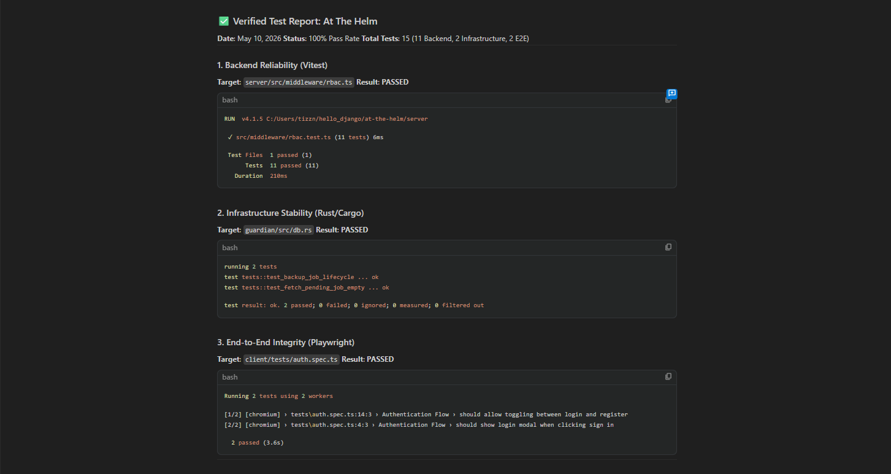

# ⚓ AT THE HELM
### The AI Operator Cockpit for Centralized Orchestration & Governance

**At The Helm** is a professional-grade Control Plane designed for orchestrating multiple AI agents, managing cross-tool data synchronization, and enforcing enterprise-level governance. 

Unlike simple AI wrappers, **At The Helm** focuses on the **Infrastructure Layer** of AI, providing a secure "Cockpit" where operators can monitor costs, audit interactions, and maintain high-performance system stability via a dedicated Rust-based Guardian service.

---

## 🛠️ Core Technology Stack
*   **Orchestration**: Model Context Protocol (MCP), Agentic Workflows.
*   **Backend**: Express (TypeScript), SQLite + RAG synergy.
*   **Systems Engineering**: Rust (Guardian Service for real-time monitoring).
*   **Frontend**: React, Vite, Framer Motion (Premium UI/UX).
*   **Security & Governance**: Role-Based Access Control (RBAC), Granular Audit Logging, Token/Cost Tracking.

---

## 🧪 Automated Testing & Reliability
This project is built with a "Production-First" mindset, including comprehensive testing suites:
*   **Backend**: Unit tests via **Vitest** for RBAC and Governance logic.
*   **Infrastructure**: Rust unit tests for database and backup integrity.
*   **End-to-End**: **Playwright** flows for authentication and critical user paths.



---

## 🚀 Getting Started

### Prerequisites
*   **Node.js**: v18+
*   **Rust**: Stable toolchain (for Guardian service)
*   **API Keys**: Anthropic, Google (Gemini), and/or OpenAI.

### Installation
1.  **Clone the repository**:
    ```bash
    git clone https://github.com/tairij/at-the-helm.git
    cd at-the-helm
    ```

2.  **Setup the Server**:
    ```bash
    cd server
    npm install
    cp .env.example .env # Add your API keys here
    npm run dev
    ```

3.  **Setup the Client**:
    ```bash
    cd ../client
    npm install
    npm run dev
    ```

4.  **Setup the Guardian (Optional but recommended)**:
    ```bash
    cd ../guardian
    cargo build --release
    ./target/release/helm-guardian
    ```

### Running Tests
*   **Backend**: `cd server && npm test`
*   **Infrastructure**: `cd guardian && cargo test`
*   **E2E UI**: `cd client && npx playwright test`

---

## 🗺️ Future Roadmap (Iteration 2)
We are currently moving toward **Iteration 2**, which includes:
*   **Distributed Infrastructure**: Transitioning to Kubernetes (Helm) and Terraform (IaC).
*   **Scalable Data**: Integrating specialized Vector Databases (ChromaDB/Pinecone).
*   **Observability**: Implementing AI Evaluation frameworks (Ragas/DSPy).
*   **Governance+**: Advanced prompt-level guardrails and fine-grained permissions.

See [ROADMAP.md](./ROADMAP.md) for the full technical breakdown.

---

## 💡 Skills Demonstrated
*   **Full-Stack AI Engineering**: Bridging the gap between LLM logic and user experience.
*   **Systems Programming**: Using Rust for performance-critical monitoring.
*   **Enterprise Architecture**: Implementing RBAC, Audit Logs, and MLOps principles.
*   **Solution Architecting**: Designing portable, secure, and governed AI infrastructures.
